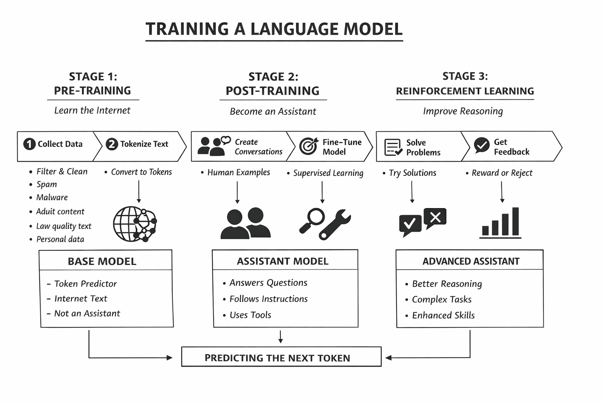

# 01 — Big Picture LLM Pipeline

This block uses one simple map:

1. **Pre-training** → build a **base model**
2. **Post-training** → shape it into an **assistant**
3. **Reinforcement Learning** → improve behavior through practice

## Outlook

## Mental model

- A base LLM is a very strong **next-token predictor**.
- An assistant LLM is a base model that was further trained to follow human-style instructions.
- Better assistant behavior does **not** mean perfect truth. It means better alignment with target behavior.

## Stage 1: Pre-training (internet-scale pattern learning)

The model is trained on large filtered text corpora and learns token patterns.

Output of this stage:

- A model that can continue text well
- Broad world knowledge in statistical form
- No guaranteed helpful chat behavior yet

## Stage 2: Post-training (assistant behavior)

The model is fine-tuned on conversation examples:

- user prompts
- preferred assistant responses
- style constraints (helpful, safe, clear)

Output of this stage:

- More instruction-following
- Better conversational tone
- Better refusal behavior in risky cases

## Stage 3: Reinforcement Learning (practice loop)

The model generates candidate responses, gets feedback/reward, and learns which response styles work better.

Output of this stage:

- More robust problem-solving behavior
- Better consistency on difficult tasks
- Still imperfect, still probabilistic

## What students should keep in mind

- LLMs are **prediction systems**, not truth engines.
- Their answers come from patterns + context, not direct understanding like humans.
- Good use requires prompting, verification, and critical judgment.

## Bridge to studio practice

In class notebooks, we apply this pipeline at **inference time** (not training time):

- prompts and system instructions shape behavior
- provided context and retrieved text improve task relevance
- output quality depends on iterative prompting + verification

## Activity

<iframe
  src="https://ai.massol.me/h5p/embed.html?activity=block-ai-text-generation/01-big-picture-llm-pipeline"
  style="width:100%; height:clamp(330px, 30vh, 900px); border:0; display:block;"
  <!-- style="width:100%; height:20vh; min-height:330px; border:0;" -->
  title="Activity Name"
  loading="lazy"
></iframe>
